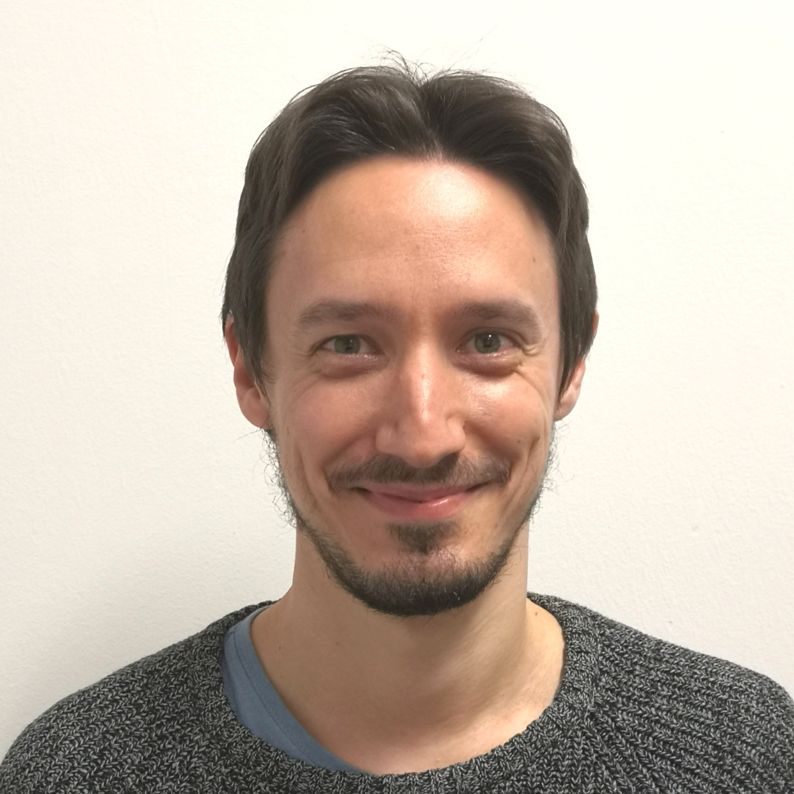

Currently, I am a postdoctoral researcher at the Department of Computer Science and Engineering (DISI) at the <a href="https://www.unibo.it/it"> University of Bologna </a>. My research interests are in computer vision and machine learning, with a particular focus on 3D reconstruction from images.

In 2021, I received my PhD degree from the University of Bologna under the supervision of Professor <a href="http://vision.deis.unibo.it/~smatt/Site/Home.html"> Stefano Mattoccia</a>. Previously, I received a Master's and Bachelor's degree in Computer Engineering in 2017 and 2014, respectively.

In 2020, I was a <a href="https://is.mpg.de/person/ftosi"> visiting PhD student </a> in the research group of the <a href="https://avg.is.mpg.de/"> Autonomous Vision Group (AVG) </a> of Professor <a href="https://www.cvlibs.net/"> Andreas Geiger </a> at the <a href="https://is.mpg.de/"> Max Planck Institute for Intelligent Systems and the University of Tübingen</a>.

In 2022, I was awarded the <a href="https://www.cvpl.it/en/awards/#miglior_tesi_dottorato"> best PhD thesis </a> by the <a href="https://www.cvpl.it/"> Italian Association for Research in Computer Vision, Pattern Recognition and Machine Learning (CVPL)</a>.

You can download my full Curriculum Vitae [here](http://fabiotosi92.github.io/files/Fabio_Tosi_s_CV.pdf)! (13/02/2023)

## News!

<ul>
  <li>
    <strong>02/2023</strong> 1 paper accepted at CVPR 2023 this year! 
  </li>
  <li>
    <strong>02/2023</strong> I received my <a href="https://asn21.cineca.it/pubblico/miur/esito/09%252FH1/2/4">National Scientific Habilitation</a> (09/H1)
  </li>
  <li>
    <strong>11/2022</strong> <a href="https://www.cvpl.it/en/awards/#miglior_tesi_dottorato">Best PhD Thesis Award</a>, Italian Association for Computer Vision Research (CVPL 2022)
  </li>
  <li>
    <strong>02/2022</strong> 2 papers accepted at 3DV 2022. 
  </li>
  <li>
    <strong>02/2022</strong> 2 papers accepted at CVPR 2022 this year!
  </li>
  <li>
    <strong>11/2021</strong> Proof of Concept d’Ateneo, PoC UNIBO 3rd edition (Principal Investigator, PI)
  </li>
  <li>
    <strong>09/2021</strong> <a href="https://3dv2021.surrey.ac.uk/prizes/">Best Paper Honorable Mention</a> to our work <strong>“Neural Disparity Refinement for Arbitrary
Resolution Stereo" </strong>
  </li>

</ul>

## My Research Team

  

    
    
Stefano Mattoccia

  

  

    
    
Matteo Poggi

  

## Publications

  

    
  

  

    <a href="https://autonomousvision.github.io/smdnets/"><strong>SMD-Nets: Stereo Mixture Density Networks</strong> </a>  
    <strong>Fabio Tosi</strong> , <a href="https://yiyiliao.github.io/">Yiyi Liao </a>, Carolin Schmitt, <a href="https://www.cvlibs.net/">Andreas Geiger </a>    
    CVPR 2021  
    <a href="https://www.cvlibs.net/publications/Tosi2021CVPR.pdf">paper</a> | <a href="http://www.cvlibs.net/publications/Tosi2021CVPR_supplementary.pdf">supplement</a> | <a href="https://autonomousvision.github.io/smdnets/">blog</a> | <a href="https://github.com/fabiotosi92/SMD-Nets">code</a> | <a href="https://www.youtube.com/watch?v=tvVGuUSe2n8&t=148s">video</a>  | <a href="http://www.cvlibs.net/publications/Tosi2021CVPR_poster.pdf">poster</a> 

    

  

