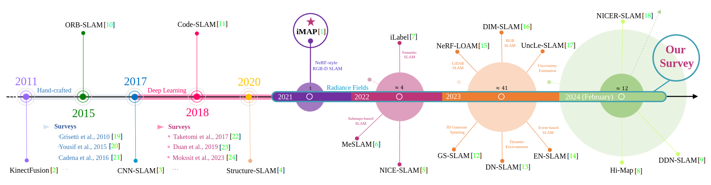

Currently, I am a Junior Assistant Professor (RTDA) at the Department of Computer Science and Engineering (DISI) at the <a href="https://www.unibo.it/it"> University of Bologna</a>, and I also serve as an Adjunct Professor for the Fundamentals of Computer Science course at the Department of Electrical, Electronic, and Information Engineering "Guglielmo Marconi". My research interests are in computer vision and machine learning, with a particular focus on 3D reconstruction from images.

In 2021, I received my PhD degree from the University of Bologna under the supervision of Professor <a href="http://vision.deis.unibo.it/~smatt/Site/Home.html"> Stefano Mattoccia</a>. Previously, I received a Master's and Bachelor's degree in Computer Engineering in 2017 and 2014, respectively.

In 2020, I was a <a href="https://is.mpg.de/person/ftosi"> visiting PhD student </a> in the research group of the <a href="https://avg.is.mpg.de/"> Autonomous Vision Group (AVG) </a> of Professor <a href="https://www.cvlibs.net/"> Andreas Geiger </a> at the <a href="https://is.mpg.de/"> Max Planck Institute for Intelligent Systems and the University of Tübingen</a>.

In 2022, I was awarded the <a href="https://www.cvpl.it/en/awards/#miglior_tesi_dottorato"> best PhD thesis </a> by the <a href="https://www.cvpl.it/"> Italian Association for Research in Computer Vision, Pattern Recognition and Machine Learning (CVPL)</a>.

You can download my full Curriculum Vitae [here](http://fabiotosi92.github.io/files/Fabio_Tosi_s_CV.pdf)! (08/03/2023)

## News!

<ul>
  <li>
    <strong>06/2024</strong> : Our <strong>CVPR tutorial</strong> on deep stereo matching is now available! Get all the insights <a href='https://sites.google.com/view/stereo-twenties'>here</a>!
  </li>
  <li>
    <strong>06/2024</strong> Our extended version of <a href='https://github.com/CVLAB-Unibo/neural-disparity-refinement'>Neural Disparity Refinement</a> has been accepted for publication in the TPAMI journal!
  </li>
  <li>
    <strong>05/2024</strong> Honored to be recognized as a <strong>Outstanding Reviewer</strong> at CVPR 2024!
  </li>
  <li>
      <strong>04/2024</strong>   The <a href='https://github.com/fabiotosi92/Awesome-Deep-Stereo-Matching'>"Awesome-Deep-Stereo-Matching"</a> repository is live! &#128640; 
  </li>
    <li>
      <strong>04/2024</strong>   3 workshops accepted for ECCV 2024! Stay tuned!
  </li>
  <li>
      <strong>02/2024</strong> 1 paper accepted to CVPR 2024!
  </li>
  <li>
      <strong>02/2024</strong> Our paper, <a href='http://fabiotosi92.github.io/files/survey-slam.pdf'>"How NeRFs and 3D Gaussian Splatting are Reshaping SLAM: a Survey"</a> is now available! Check it out on arXiv!
  </li>
  <li>
      <strong>01/2024</strong> &#128226;&#128226;&#128226; Our workshop, <a href='https://jspenmar.github.io/MDEC/'>"MDEC - (3rd) Monocular Depth Estimation Challenge"</a>  is officially part of CVPR 2024! Check the <a href='https://codalab.lisn.upsaclay.fr/competitions/17161'>challenge!</a>
  </li>
  <li>
      <strong>02/2024</strong> &#128680;&#128680;&#128680; The <a href='https://cvlab-unibo.github.io/booster-web/ntire24.html'>2nd NTIRE challenge</a> (CVPR 2024)  is now live! 
  </li>
  <li>
    <strong>10/2023</strong> I am proud to announce my new role as a <strong>Junior Assistant Professor (RTDA)</strong> at the Department of Computer Science and Engineering (DISI)!
  </li>
  <li>
    <strong>10/2023</strong> We are excited to announce that our extended version of <a href='https://cvlab-unibo.github.io/booster-web/'>Booster</a> has been officially accepted for publication in the TPAMI journal!
  </li>
  <li>
    <strong>07/2023</strong>  Our team rocks! 4 papers accepted at ICCV 2023! &#128640; &#128640; &#128640; &#128640;
  </li>
  <li>
    <strong>05/2023</strong> It is with great pleasure that I announce my achievement as an <strong>Outstanding Reviewer</strong> at CVPR 2023! (<a href='http://fabiotosi92.github.io/files/cvpr23_outstanding_certificate.pdf'>Award Certificate</a>)
  </li>
  <li>
    <strong>02/2023</strong> Our paper <a href='https://nerfstereo.github.io/'>NeRF-Supervised Deep Stereo</a> has been accepted at CVPR 2023! 
  </li>

  <li>
    <strong>02/2023</strong> I received my <a href="https://asn21.cineca.it/pubblico/miur/esito/09%252FH1/2/4">National Scientific Habilitation</a> (09/H1)
  </li>
  <li>
    <strong>11/2022</strong> 🏆 Celebrating the recognition of the <a href="https://www.cvpl.it/en/awards/#miglior_tesi_dottorato">Best PhD Thesis Award</a> from the Italian Association for Computer Vision Research (CVPL 2022)
  </li>
  <li>
    <strong>11/2021</strong> Proof of Concept d’Ateneo, PoC UNIBO 3rd edition (Principal Investigator, PI)
  </li>
  <li>
    <strong>09/2021</strong> <a href="https://3dv2021.surrey.ac.uk/prizes/">Best Paper Honorable Mention</a> to our work <strong>“Neural Disparity Refinement for Arbitrary
Resolution Stereo" </strong>
  </li>

</ul>

## My Research Team

  

    
    
Stefano Mattoccia

  

  

    
    
Matteo Poggi

  

## Publications

Full publication list on <a href="https://scholar.google.com/citations?user=5-UOaQkAAAAJ&hl=it"> Google Scholar</a>  
*indicates joint first authorship

  

    
  

  

    <a href="https://arxiv.org/pdf/2402.13255.pdf"><papertitle>How NeRFs and 3D Gaussian Splatting are
Reshaping SLAM: a Survey</papertitle></a> - <reddish> NEW!</reddish>   
    <strong>Fabio Tosi</strong>, <a href="https://youmi-zym.github.io/">Youmin Zhang</a>, <a href="https://zorangong.github.io/"> Ziren Gong</a>, Erik Sandström,  <a href="http://vision.deis.unibo.it/~smatt/Site/Home.html">Stefano Mattoccia</a>, <a href="https://cvg.ethz.ch/team/Dr-Martin-R-Oswald"> Martin R. Oswald</a>, <a href="https://mattpoggi.github.io/">Matteo Poggi</a>    
    <a href="https://arxiv.org/pdf/2402.13255.pdf">paper</a> (arXiv - Pre-print, 2024)

    

  

  

    
  

  

    <a href="https://youmi-zym.github.io/projects/GO-SLAM/"><papertitle>GO-SLAM        
Global Optimization for Consistent 3D Instant Reconstruction</papertitle></a>   
    <a href="https://youmi-zym.github.io/">Youmin Zhang</a>, <strong>Fabio Tosi</strong>, <a href="http://vision.deis.unibo.it/~smatt/Site/Home.html">Stefano Mattoccia</a>, <a href="https://mattpoggi.github.io/">Matteo Poggi</a>    
    <i>International Conference on Computer Vision</i> (<strong>ICCV</strong>), 2023   
    <a href="https://youmi-zym.github.io/projects/GO-SLAM/">project page</a>  | <a href="https://arxiv.org/pdf/2309.02436.pdf">paper</a> | <a href="https://github.com/youmi-zym/GO-SLAM">code</a> 

    

  

  

    
  

  

    <a href="https://youmi-zym.github.io/projects/GO-SLAM/"><papertitle>Active Stereo Without Pattern Projector</papertitle></a> - <reddish> NEW!</reddish>   
    <a href="https://bartn8.github.io/">Luca Bartolomei</a>, <a href="https://mattpoggi.github.io/">Matteo Poggi</a>, <strong>Fabio Tosi</strong>, <a href="https://andreaconti.github.io//">Andrea Conti</a>, <a href="http://vision.deis.unibo.it/~smatt/Site/Home.html">Stefano Mattoccia</a>   
    <i>International Conference on Computer Vision</i> (<strong>ICCV</strong>), 2023   
    <a href="https://vppstereo.github.io/">project page</a>  | <a href="">paper</a> | <a href="https://github.com/bartn8/vppstereo">code</a> 

    

  

  

    
  

  

    <a href="https://nerfstereo.github.io/"><papertitle>NeRF-Supervised Deep Stereo</papertitle></a>   
    <strong>Fabio Tosi</strong>, <a href="https://alessiotonioni.github.io/">Alessio Tonioni</a>, <a href="https://www.eyecan.ai/">Daniele De Gregorio</a>, <a href="https://mattpoggi.github.io/">Matteo Poggi</a>    
    <i>Conference on Computer Vision and Pattern Recognition</i> (<strong>CVPR</strong>), 2023   
    <a href="https://nerfstereo.github.io/">project page</a>  | <a href="https://openaccess.thecvf.com/content/CVPR2023/papers/Tosi_NeRF-Supervised_Deep_Stereo_CVPR_2023_paper.pdf">paper</a> | <a href="https://github.com/fabiotosi92/NeRF-Supervised-Deep-Stereo/raw/main/assets/Tosi_et_al_CVPR2023_supplementary.pdf">supplementary</a> | <a href="https://github.com/fabiotosi92/NeRF-Supervised-Deep-Stereo">code</a> | <a href="https://amsacta.unibo.it/id/eprint/7218/">dataset</a> | <a href="https://www.youtube.com/watch?v=m7dqHkxb4yg&feature=youtu.be">video</a>

    

  

  

    
  

  

    <a href="https://cvlab-unibo.github.io/neural-disparity-refinement-web/"><papertitle>Neural Disparity Refinement for Arbitrary Resolution Stereo</papertitle> </a>  
    
(Best Paper Honorable Mention at 3DV 2021)
 
    <a href="https://filippoaleotti.github.io/website/">Filippo Aleotti*</a>, <strong>Fabio Tosi*</strong>, <a href="https://pierlui92.github.io/">Pierluigi Zama Ramirez*</a>, <a href="https://mattpoggi.github.io/">Matteo Poggi</a>, <a href="https://www.unibo.it/sitoweb/samuele.salti">Samuele Salti</a>, <a href="http://vision.deis.unibo.it/~smatt/Site/Home.html">Stefano Mattoccia</a>, <a href="https://www.unibo.it/sitoweb/luigi.distefano">Luigi Di Stefano</a>   
    <i>International Conference on 3D Vision </i> (<strong>3DV</strong>), 2021  
    <a href="https://cvlab-unibo.github.io/neural-disparity-refinement-web/">project page</a>  | <a href="https://arxiv.org/abs/2110.15367">paper & supplementary</a> | <a href="https://github.com/CVLAB-Unibo/neural-disparity-refinement">code</a> 

    

  

  

    
  

  

    <a href="https://github.com/zxcqlf/MonoViT"><papertitle>Monovit: Self-supervised monocular depth estimation with a vision transformer</papertitle> </a>  
    <a href="https://zxcqlf.github.io/">Chaoqiang Zhao</a>, <a href="https://youmi-zym.github.io/">Youmin Zhang</a>, <a href="https://mattpoggi.github.io/">Matteo Poggi</a>, <strong>Fabio Tosi,</strong>, Xianda Guo, Zheng Zhu, Guan Huang, Yang Tang, <a href="http://vision.deis.unibo.it/~smatt/Site/Home.html">Stefano Mattoccia</a>   
    <i>International Conference on 3D Vision </i> (<strong>3DV</strong>), 2022  
    <a href="https://arxiv.org/abs/2208.03543">paper</a> | <a href="https://github.com/zxcqlf/MonoViT">code</a>

    

  

  

    
  

  

    <a href="https://cvlab-unibo.github.io/xnerf-web/"><papertitle>
Cross-Spectral Neural Radiance Fields</papertitle> </a>  
    <a href="https://mattpoggi.github.io/">Matteo Poggi*</a>, <a href="https://pierlui92.github.io/">Pierluigi Zama Ramirez*</a>, <strong>Fabio Tosi*</strong>, <a href="https://www.unibo.it/sitoweb/samuele.salti">Samuele Salti</a>, <a href="http://vision.deis.unibo.it/~smatt/Site/Home.html">Stefano Mattoccia</a>, <a href="https://www.unibo.it/sitoweb/luigi.distefano">Luigi Di Stefano</a>   
    <i>International Conference on 3D Vision </i> (<strong>3DV</strong>), 2022   
    <a href="https://arxiv.org/abs/2209.00648">paper</a> | <a href="https://drive.google.com/file/d/1V40AeNQ7qacg4GlxK_6jmfm6bCcqykms/view">video & supplementary</a> | <a href="http://amsacta.unibo.it/7142/">dataset</a>

    

  

  

    
  

  

    <a href="https://cvlab-unibo.github.io/booster-web/"><papertitle>
Open Challenges in Deep Stereo: the Booster Dataset</papertitle> </a>  
    <a href="https://pierlui92.github.io/">Pierluigi Zama Ramirez*</a>, <strong>Fabio Tosi*</strong>, <a href="https://mattpoggi.github.io/">Matteo Poggi*</a>, <a href="https://www.unibo.it/sitoweb/samuele.salti">Samuele Salti</a>, <a href="http://vision.deis.unibo.it/~smatt/Site/Home.html">Stefano Mattoccia</a>, <a href="https://www.unibo.it/sitoweb/luigi.distefano">Luigi Di Stefano</a>      <i>Conference on Computer Vision and Pattern Recognition</i> (<strong>CVPR</strong>), 2022   
    <a href="https://openaccess.thecvf.com/content/CVPR2022/papers/Ramirez_Open_Challenges_in_Deep_Stereo_The_Booster_Dataset_CVPR_2022_paper.pdf">paper</a> | <a href="https://openaccess.thecvf.com/content/CVPR2022/supplemental/Ramirez_Open_Challenges_in_CVPR_2022_supplemental.pdf">supplementary</a> | <a href="http://amsacta.unibo.it/6876/">dataset</a>  | <a href="https://cvlab-unibo.github.io/booster-web/benchmark.html">benchmark</a> | <a href="https://youtu.be/EEg3z9b_Bt4">video</a>

    

  

  

    
  

  

    <a href="https://cvlab-unibo.github.io/rgb-ms-web/"><papertitle>
RGB-Multispectral Matching: Dataset, Learning Methodology, Evaluation</papertitle> </a>  
    <strong>Fabio Tosi*</strong>, <a href="https://pierlui92.github.io/">Pierluigi Zama Ramirez*</a>, <a href="https://mattpoggi.github.io/">Matteo Poggi*</a>, <a href="https://www.unibo.it/sitoweb/samuele.salti">Samuele Salti</a>, <a href="http://vision.deis.unibo.it/~smatt/Site/Home.html">Stefano Mattoccia</a>, <a href="https://www.unibo.it/sitoweb/luigi.distefano">Luigi Di Stefano</a>      <i>Conference on Computer Vision and Pattern Recognition</i> (<strong>CVPR</strong>), 2022   
    <a href="https://openaccess.thecvf.com/content/CVPR2022/papers/Tosi_RGB-Multispectral_Matching_Dataset_Learning_Methodology_Evaluation_CVPR_2022_paper.pdf">paper</a> | <a href="https://openaccess.thecvf.com/content/CVPR2022/supplemental/Tosi_RGB-Multispectral_Matching_Dataset_CVPR_2022_supplemental.pdf">supplementary</a> | <a href="http://amsacta.unibo.it/6877/">dataset</a>  | <a href="https://youtu.be/dmN23_rnmjQ">video</a>

    

  

  

    
  

  

    <papertitle>
On the Synergies Between Machine Learning and Binocular Stereo for Depth Estimation From Images: A Survey</papertitle>  
    <a href="https://mattpoggi.github.io/">Matteo Poggi</a>, <strong>Fabio Tosi</strong>, Konstantinos Batsos, <a href="https://mordohai.github.io/">Philippos Mordohai</a>, <a href="http://vision.deis.unibo.it/~smatt/Site/Home.html">Stefano Mattoccia</a>   
    <i>IEEE Transactions on Pattern Analysis and Machine Intelligence</i> (<strong>TPAMI</strong>), 2021  
    <a href="https://arxiv.org/abs/2004.08566">paper</a>

    

  

  

    
  

  

    <a href="https://autonomousvision.github.io/smdnets/"><papertitle>SMD-Nets: Stereo Mixture Density Networks</papertitle> </a>  
    <strong>Fabio Tosi,</strong> <a href="https://yiyiliao.github.io/">Yiyi Liao</a>, Carolin Schmitt, <a href="https://www.cvlibs.net/">Andreas Geiger </a>    
    <i>Conference on Computer Vision and Pattern Recognition</i> (<strong>CVPR</strong>), 2021    
    <a href="https://www.cvlibs.net/publications/Tosi2021CVPR.pdf">paper</a> | <a href="http://www.cvlibs.net/publications/Tosi2021CVPR_supplementary.pdf">supplement</a> | <a href="https://autonomousvision.github.io/smdnets/">blog</a> | <a href="https://github.com/fabiotosi92/SMD-Nets">code</a> | <a href="https://www.youtube.com/watch?v=tvVGuUSe2n8&t=148s">video</a>  | <a href="http://www.cvlibs.net/publications/Tosi2021CVPR_poster.pdf">poster</a> 

    

  

  

    
  

  

    <a href="https://github.com/CVLAB-Unibo/omeganet"><papertitle>Distilled Semantics for Comprehensive Scene Understanding from Videos</papertitle> </a>  
    <strong>Fabio Tosi*</strong>, <a href="https://filippoaleotti.github.io/website/">Filippo Aleotti*</a>, <a href="https://pierlui92.github.io/">Pierluigi Zama Ramirez*</a>, <a href="https://mattpoggi.github.io/">Matteo Poggi</a>, <a href="https://www.unibo.it/sitoweb/samuele.salti">Samuele Salti</a>, <a href="http://vision.deis.unibo.it/~smatt/Site/Home.html">Stefano Mattoccia</a>, <a href="https://www.unibo.it/sitoweb/luigi.distefano">Luigi Di Stefano</a>   
    <i>Conference on Computer Vision and Pattern Recognition</i> (<strong>CVPR</strong>), 2020    
    <a href="https://openaccess.thecvf.com/content_CVPR_2020/papers/Tosi_Distilled_Semantics_for_Comprehensive_Scene_Understanding_from_Videos_CVPR_2020_paper.pdf">paper</a> | <a href="https://openaccess.thecvf.com/content_CVPR_2020/supplemental/Tosi_Distilled_Semantics_for_CVPR_2020_supplemental.pdf">supplementary</a> | <a href="https://github.com/CVLAB-Unibo/omeganet">code</a> | <a href="https://github.com/CVLAB-Unibo/omeganet/blob/master/assets/poster.pdf">poster</a>

    

  
 

  

    
  

  

    <papertitle>Learning monocular depth estimation infusing traditional stereo knowledge</papertitle>  
    <strong>Fabio Tosi</strong>, <a href="https://filippoaleotti.github.io/website/">Filippo Aleotti</a>, <a href="https://mattpoggi.github.io/">Matteo Poggi</a>, <a href="http://vision.deis.unibo.it/~smatt/Site/Home.html">Stefano Mattoccia</a>  
    <i>Conference on Computer Vision and Pattern Recognition</i> (<strong>CVPR</strong>), 2019    
    <a href="https://openaccess.thecvf.com/content_CVPR_2019/papers/Tosi_Learning_Monocular_Depth_Estimation_Infusing_Traditional_Stereo_Knowledge_CVPR_2019_paper.pdf">paper</a> | | <a href="https://openaccess.thecvf.com/content_CVPR_2020/supplemental/Tosi_Distilled_Semantics_for_CVPR_2020_supplemental.pdf">supplementary</a> | <a href="https://github.com/fabiotosi92/monoResMatch-Tensorflow">code</a> | <a href="https://vision.disi.unibo.it/~ftosi/papers/monoResMatch_poster.pdf">poster</a> | <a href="https://www.youtube.com/watch?v=h6Wo5MqbCY0&t=2s">video</a>

    

  
 

  

    
  

  

    <papertitle>Real-time self-adaptive deep stereo</papertitle>   
    
ORAL!

    <a href="https://alessiotonioni.github.io/">Alessio Tonioni</a>, <strong>Fabio Tosi</strong>, <a href="https://mattpoggi.github.io/">Matteo Poggi</a>, <a href="http://vision.deis.unibo.it/~smatt/Site/Home.html">Stefano Mattoccia</a>  
    <i>Conference on Computer Vision and Pattern Recognition</i> (<strong>CVPR</strong>), 2019    
    <a href="https://openaccess.thecvf.com/content_CVPR_2019/papers/Tonioni_Real-Time_Self-Adaptive_Deep_Stereo_CVPR_2019_paper.pdf">paper</a> | <a href="https://openaccess.thecvf.com/content_CVPR_2019/supplemental/Tonioni_Real-Time_Self-Adaptive_Deep_CVPR_2019_supplemental.pdf">supplementary</a> | <a href="https://github.com/CVLAB-Unibo/Real-time-self-adaptive-deep-stereo">code</a> | <a href="https://www.youtube.com/watch?v=7SjyzDxmCY4">video</a> | <a href="https://www.youtube.com/watch?v=4O-7OzVYAeU">live demo</a>

    

  
 

  

    
  

  

    <papertitle>Guided Stereo Matching</papertitle>   
    <a href="https://mattpoggi.github.io/">Matteo Poggi*</a>, Davide Pallotti*, <strong>Fabio Tosi</strong>, <a href="http://vision.deis.unibo.it/~smatt/Site/Home.html">Stefano Mattoccia</a> 
    <i>Conference on Computer Vision and Pattern Recognition</i> (<strong>CVPR</strong>), 2019   
    <a href="https://openaccess.thecvf.com/content_CVPR_2019/papers/Poggi_Guided_Stereo_Matching_CVPR_2019_paper.pdf">paper</a> | <a href="https://github.com/mattpoggi/guided-stereo">demo code</a> | <a href="https://www.youtube.com/watch?v=AVlPu3K2ays">video</a> | <a href="https://vision.deis.unibo.it/~mpoggi/papers/cvpr2019guided_poster.pdf">poster</a>

    

  
 

 

  

    
  

  

    <papertitle>Reversing the cycle: self-supervised deep stereo
through enhanced monocular distillation</papertitle>   
    <a href="https://filippoaleotti.github.io/website/">Filippo Aleotti*</a>, <strong>Fabio Tosi*</strong>, Li Zhang,
    <a href="https://mattpoggi.github.io/">Matteo Poggi</a>, , <a href="http://vision.deis.unibo.it/~smatt/Site/Home.html">Stefano Mattoccia</a> 
    <i>European Conference on Computer Vision </i> (<strong>ECCV</strong>), 2020
  
    <a href="https://arxiv.org/pdf/2008.07130.pdf">paper</a> | <a href="https://github.com/FilippoAleotti/Reversing">code</a> | <a href="https://drive.google.com/file/d/1V1vrMtEw6uy3TfAW0wXlc-zxxsuIlJY2/view">video</a> 

    

  
 

 