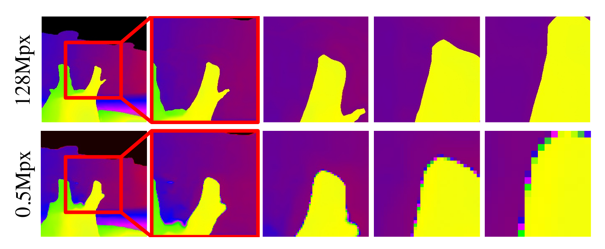

  

    
  

  

    <strong>SMD-Nets: Stereo Mixture Density Networks</strong>   
    Fabio Tosi, Yiyi Liao, Carolin Schmitt, Andreas Geiger   
    CVPR 2021  
    <a href="https://www.cvlibs.net/publications/Tosi2021CVPR.pdf">paper</a> | <a href="http://www.cvlibs.net/publications/Tosi2021CVPR_supplementary.pdf">supplement</a> | <a href="https://autonomousvision.github.io/smdnets/">blog</a> | <a href="https://autonomousvision.github.io/smdnets/">code</a> | <a href="https://www.youtube.com/watch?v=tvVGuUSe2n8&t=148s">video</a>  | <a href="http://www.cvlibs.net/publications/Tosi2021CVPR_poster.pdf">poster</a> 

    

  

---
